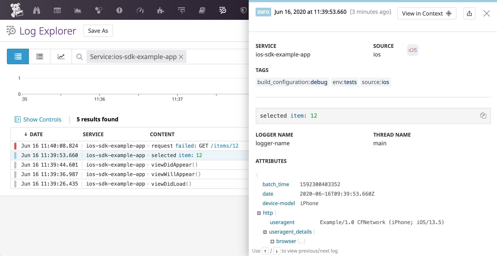
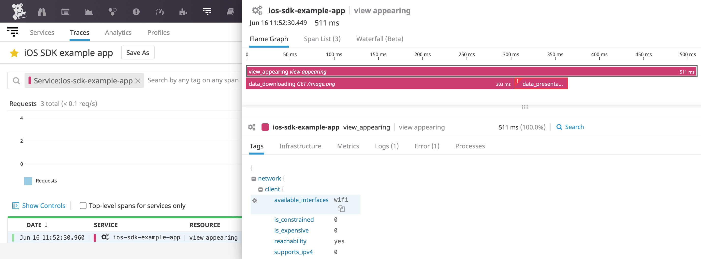
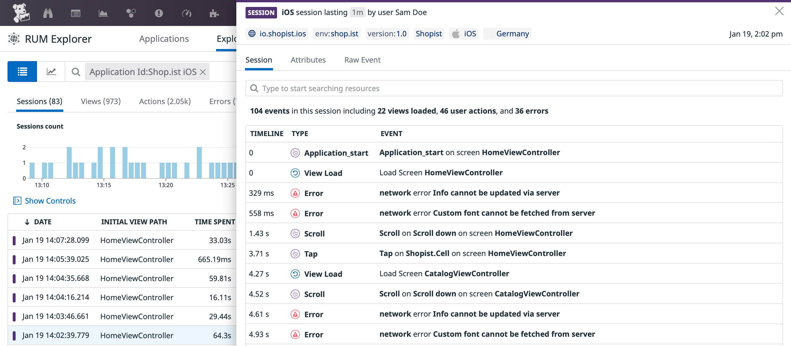

    
    
    
    

# Atatus SDK for iOS and tvOS

> Swift and Objective-C libraries to interact with Atatus on iOS and tvOS.

## Getting Started

### Log Collection

See the dedicated [Atatus iOS Log Collection][1] documentation to learn how to send logs from your iOS application to Atatus.

### Trace Collection

See [Atatus iOS Trace Collection][2] documentation to try it out.

### RUM Events Collection

See [Atatus iOS RUM Collection][3] documentation to try it out.

#### WebView Tracking

RUM allows you to monitor web views and eliminate blind spots in your hybrid mobile applications. See [WebView Tracking][5] documentation to try it out.

## Integrations

If you use [Alamofire][7], [Apollo GraphQL][8], [SDWebImage][9], or [OpenAPI Generator][10], see [Integrated Libraries][4] to learn how to instrument requests automatically.

## Contributing

Pull requests are welcome. First, open an issue to discuss what you would like to change. For more information, read the [Contributing Guide](CONTRIBUTING.md).

## License

[Apache License, v2.0](LICENSE)

## Supported Versions

See the [Supported Versions][6] documentation for more details.

[1]: https://docs.atatus.com/logs/log_collection/ios
[2]: https://docs.atatus.com/tracing/setup_overview/setup/ios
[3]: https://docs.atatus.com/real_user_monitoring/ios
[4]: https://docs.atatus.com/real_user_monitoring/mobile_and_tv_monitoring/integrated_libraries/ios
[5]: https://docs.atatus.com/real_user_monitoring/mobile_and_tv_monitoring/web_view_tracking?tab=ios
[6]: https://docs.atatus.com/real_user_monitoring/mobile_and_tv_monitoring/supported_versions/ios/
[7]: https://github.com/Alamofire/Alamofire
[8]: https://github.com/apollographql/apollo-ios
[9]: https://github.com/SDWebImage/SDWebImage
[10]: https://github.com/OpenAPITools/openapi-generator
